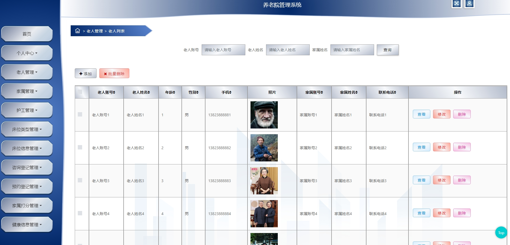
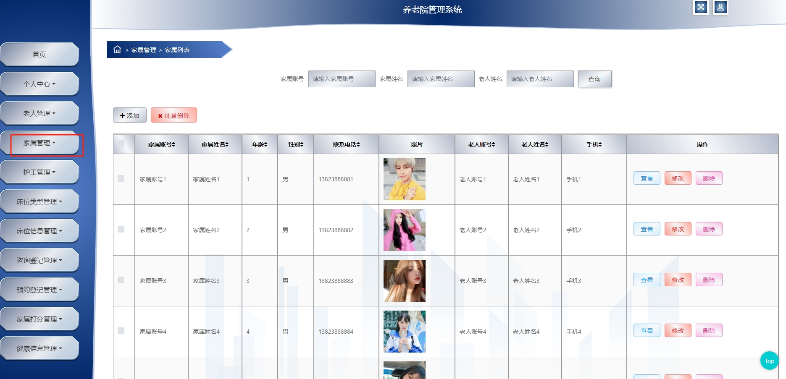
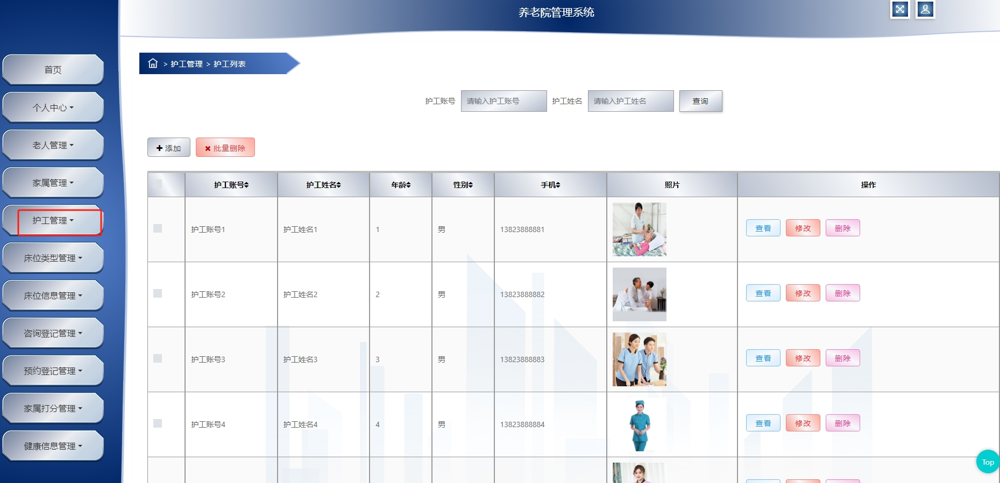
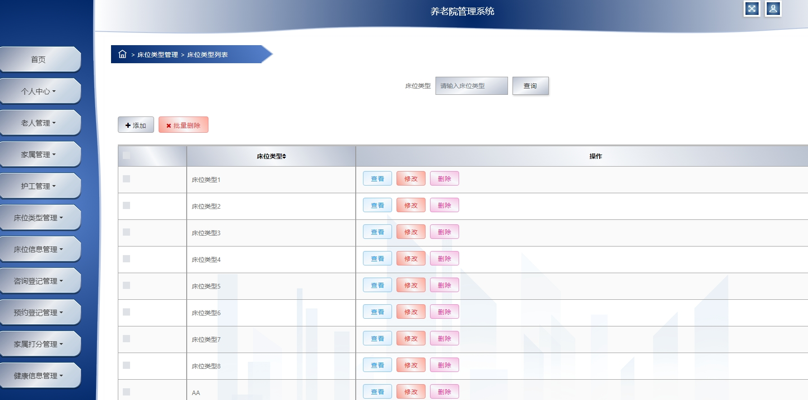
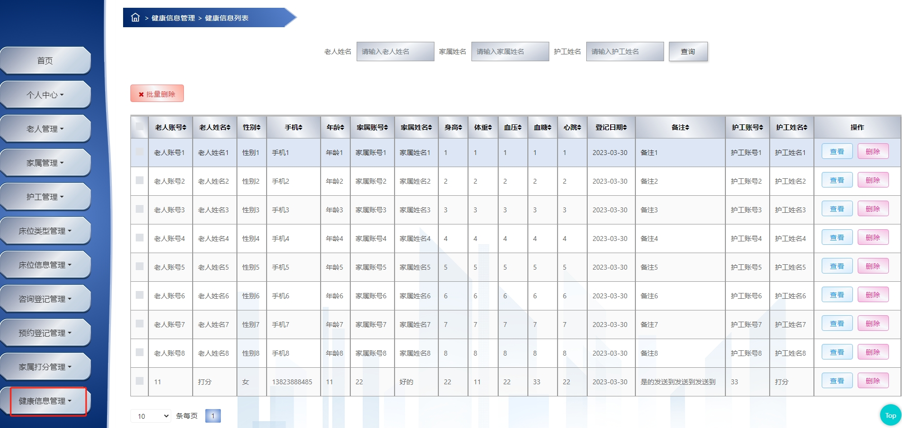
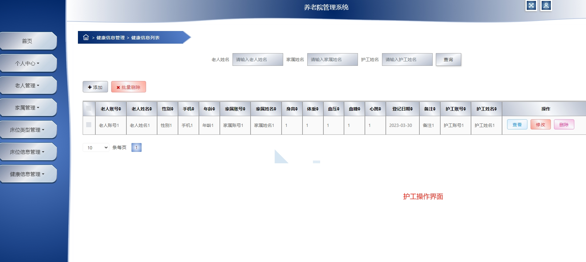
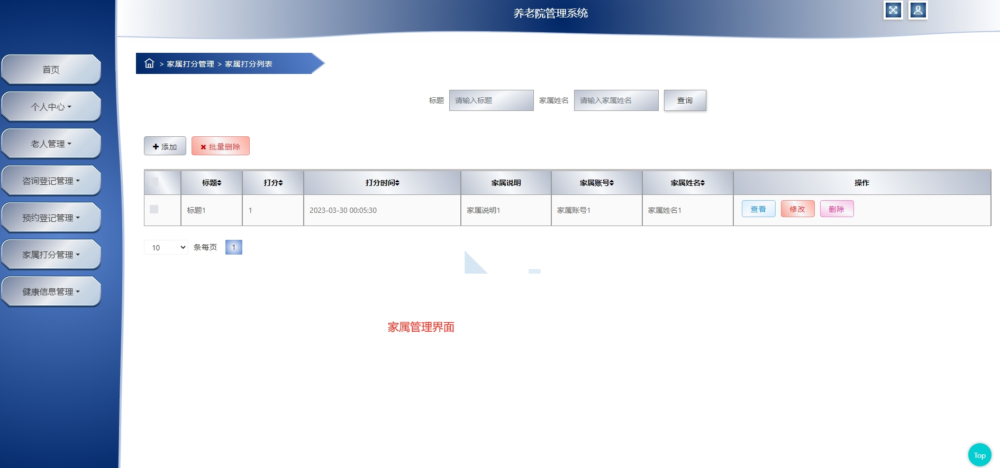
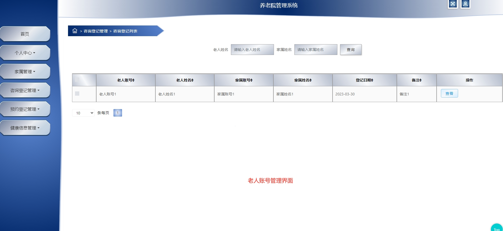
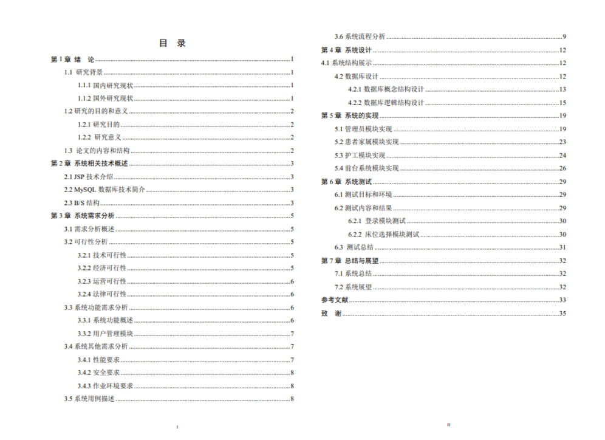

# 1.项目介绍
- 系统角色:管理员,护工,家属,老人
- 功能模块:管理员（预约登记管理、护工管理、家属管理、老人管理、咨询登记管理、床位信息管理、家属打分管理、床位类别管理），护工（个人中心，健康信息管理），家属（预约登记、床位信息查看、咨询、床位类别查看、健康信息查看）、老人（查看各种信息）
- 技术栈：SSM，JSP，具体的第三方依赖可以查看pom.xml文件
- 测试环境：idea2024，jdk1.8，maven3，mysql5.7，tomat8.5
# 2.项目部署
- 创建数据库，导入sql，数据库版本不要低于5.7
- 通过idea打开项目，配置好maven，根据本地数据库环境配置src/main/resources/config.properties  3-5行
- 配置tomcat，路径配置的是/jspmr435z
- 启动项目，http://localhost:8080/jspmr435z/jsp/login.jsp，管理员账号密码：admin、admin，其他账号查看对应的表
# 3.项目部分截图

# 4.获取方式
[戳我查看](https://gitee.com/aven999/mall)